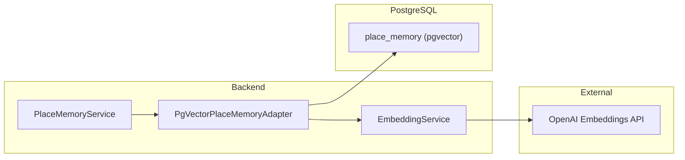

# pgvector 기반 Place Memory 구현 계획

나중에 Place Memory(벡터 검색)가 필요해질 때, Chroma 대신 **PostgreSQL pgvector**로 같은 기능을 구현하는 방법이다. 별도 서비스 없이 기존 DB만 사용한다.

---

## 아키텍처

- **PlaceMemoryPort** 구현체: `PgVectorPlaceMemoryAdapter` (기존 Chroma 어댑터 제거 후 추가)
- **임베딩**: `PlaceWithCuration.toDocument()` 및 검색 쿼리 문장 → OpenAI Embeddings API (`text-embedding-3-small`, 1536차원)
- **저장/검색**: 동일 Postgres에 `place_memory` 테이블 + `vector(1536)` 컬럼, 유사도는 코사인 거리(`<=>`)

---

## 1. DB 스키마 (Flyway)

**파일**: `backend/src/main/resources/db/migration/V7__create_place_memory_pgvector.sql` (신규)

- `CREATE EXTENSION IF NOT EXISTS vector;`
- 테이블: `place_memory`
  - `id` UUID PK
  - `place_id` VARCHAR NOT NULL UNIQUE (장소 ID, Chroma와 동일)
  - `embedding` vector(1536) NOT NULL
  - `payload` JSONB NOT NULL (PlaceWithCuration 복원용: place + curation 필드)
  - `created_at` TIMESTAMPTZ DEFAULT now()
- 인덱스: `CREATE INDEX ... ON place_memory USING ivfflat (embedding vector_cosine_ops) WITH (lists = 100);` (또는 HNSW, 데이터 많아지면 조정)

Supabase / RDS PostgreSQL 15+ 에서는 pgvector 확장 지원하므로 기존 인프라 그대로 사용 가능.

---

## 2. 임베딩 생성 (OpenAI)

- **API**: OpenAI Embeddings API (`/v1/embeddings`), 모델 `text-embedding-3-small` (1536차원, 저렴).
- **구현 위치**: 기존 `OpenAiClient`에 `createEmbedding(text: String): FloatArray` 추가하거나, 별도 `EmbeddingService`(또는 `OpenAiEmbeddingClient`)에서 RestClient로 호출.
- **사용처**:
  - 저장: `PlaceWithCuration.toDocument()` → 한 번에 임베딩
  - 검색: 사용자 쿼리 문자열 → 한 번 임베딩 후 pgvector 쿼리

---

## 3. PlaceMemoryPort 구현: PgVectorPlaceMemoryAdapter

**위치**: `backend/.../infrastructure/persistence/place/` 또는 `infrastructure/external/` (Chroma 제거 후 동일 레이어)

- **addToMemory**: 단일 장소 → `toDocument()` 임베딩 → `place_memory` INSERT (place_id, embedding, payload)
- **addBatchToMemory**: 배치마다 문서 텍스트 리스트 → OpenAI Embeddings API 한 번에 여러 개 호출(배치 지원 시) 또는 순차 호출 후, INSERT batch.
- **searchSimilar**: 쿼리 문자열 임베딩 → `SELECT * FROM place_memory ORDER BY embedding <=> $1 LIMIT $2` → 결과 row의 `payload` JSONB를 역직렬화해 `PlaceWithCuration` 리스트로 반환.
- **clearMemory**: `DELETE FROM place_memory` 또는 `TRUNCATE place_memory`.
- **count**: `SELECT COUNT(*) FROM place_memory`.

**벡터 전달**: JDBC에서 pgvector 타입은 문자열 `"[0.1,0.2,...]"` 형태로 전달하거나, [pgvector-java](https://github.com/pgvector/pgvector-java) 등 라이브러리 사용. Spring에서는 `JdbcTemplate` + 네이티브 SQL로 처리하면 된다.

**payload 직렬화**: `PlaceWithCuration`을 JSON으로 저장(Jackson). Chroma의 `toMetadata`/`fromMetadata`와 동일한 필드를 JSON으로 두고 읽을 때 `Place` + `PlaceCurationInfo`로 복원.

---

## 4. 설정

- **application.yml**: 예시
  - `place-memory.pgvector.enabled: true`
  - 임베딩 모델명(기본 `text-embedding-3-small`), 차원(1536)
- 기존 Datasource로 동일 DB 접속; 별도 URL 불필요.

---

## 5. 활성화 조건

- Chroma 제거 후, `PlaceMemoryPort` 빈은 하나만 두기: `PgVectorPlaceMemoryAdapter`만 등록하거나, `place-memory.pgvector.enabled=true`일 때만 이 어댑터를 로드하고, false면 기존처럼 Noop 유지해도 됨.
- 로컬/CI: Postgres만 있으면 되므로, 기존 CI(Postgres 서비스 컨테이너)에서 pgvector 확장만 활성화하면 테스트 가능.

---

## 6. 작업 순서 요약

1. Chroma 완전 제거(기존 계획대로 진행).
2. Flyway V7 추가: pgvector 확장 + `place_memory` 테이블.
3. OpenAI Embeddings 호출 로직 추가(OpenAiClient 또는 EmbeddingService).
4. `PgVectorPlaceMemoryAdapter` 구현 및 `PlaceMemoryPort`로 등록.
5. application.yml에 place-memory(pgvector) 설정 추가.
6. 단위/통합 테스트: Postgres + pgvector 로컬 또는 테스트 컨테이너로 검증.

---

## 7. 비용·운영

- **비용**: Chroma용 Fargate/EC2 제거됨. OpenAI Embeddings 호출 비용만 추가(text-embedding-3-small은 저렴).
- **운영**: 벡터 DB 별도 배포/헬스체크 없음. 기존 Postgres 백업/스케일만 관리하면 됨.

이 계획을 문서로만 두었다가, Place Memory가 필요해질 때 위 순서대로 구현하면 된다.
